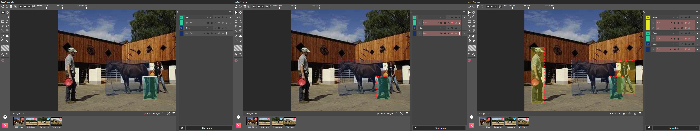

# Detecting Mislabeled Annotations with Superannotate

Several ML techniques explore the problem of detecting mislabeled annotations in noisy data. SuperAnnotate allows users to detect risky annotations and import them to the platform via the instance-based **Approve/Disapprove** functionality.

As a result, risky annotations are automatically suggested to be disapproved and a significant portion of images with clean annotations exit the QA process.


- [Installation](#installation)
- [Running the code](#running-the-code)
- [Tutorials](#tutorials)
- [License](License)


## Installation

Our [Colab Notebook](https://colab.research.google.com/drive/1Xbt3dxkmX4ozQhdY_vnHXAH67OUeg0Nj#scrollTo=FAU5T1yp4Ui2&uniqifier=2) has step by step instructions on installation of mislabel detection package and its dependencies.  

## Requirements
- Linux or macOS with Python ≥ 3.6
- PyTorch ≥ 1.4 and [torchvision](https://github.com/pytorch/vision/) that matches the PyTorch installation.
- [Detectron2](https://github.com/facebookresearch/detectron2) and its dependencies

Run this commands to install [Superannotate Python SDK](https://github.com/superannotateai/superannotate-python-sdk) and mislabel detection package

    pip install superannotate
    pip install git+https://github.com/superannotateai/qa-automation

## Running the code


We implemented a simple method to detect mislabeled bounding box annotations in data using Fast-RCNN softmax logits. 

The code block below detects mislabeled and missing bounding box annotations in given noisy dataset.

```python
import autoqa

configs = autoqa.train_fastrcnn_on_noisy_dataset(dataset_root, batch_size = 4, num_iter = 200)

autoqa.detect_mislabeled_annotations(configs)
autoqa.detect_missing_annotations(configs)
```
It generates the annotation output in SuperAnnotate’s format with the **error** field enabled for noisy annotations. 

```json

[{
  "type": "bbox",
  "classId": 9,
  "className": "cat", 
  "points": {"x1": 130.0, "x2": 251.0, "y1": 227.0, "y2": 315.0},
  "error": true
  }]
```

Detected risky annotations can be imported to the SuperAnnotate platform via Superannotate Python SDK.  


```python
import superannotate as sa

sa.upload_annotations_from_folder_to_project(sa_project, os.path.join("mislabeled_annotations"))
sa.upload_annotations_from_folder_to_project(sa_project, os.path.join("missing_annotations"))

```



## Tutorials

See our [Colab Notebook](https://colab.research.google.com/drive/1Xbt3dxkmX4ozQhdY_vnHXAH67OUeg0Nj#scrollTo=FAU5T1yp4Ui2&uniqifier=2) as a step-by-step guide for detecting mislabeled annotations in PASCAL VOC dataset.  

## License

This project is licensed under the Apache License - see the LICENSE.md file for details.


